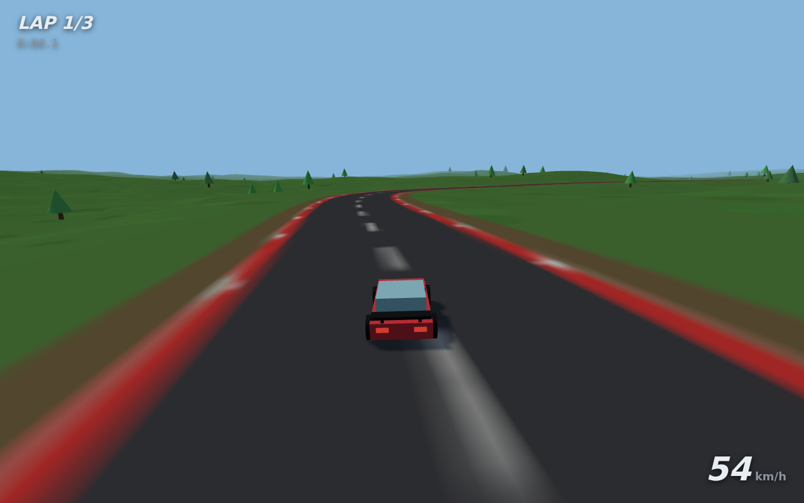

# FarleyRace

A Rails-based 3D multiplayer racing game. Three.js on the client, ActionCable
for real-time state sync, no accounts — players share a 6-character lobby code.



## Running it

Requires Ruby 3.4+ (see `.ruby-version`).

```sh
bundle install
bin/rails db:prepare
bin/rails server
```

Open http://localhost:3000, enter a name, create a lobby, and share the code
(or the "Copy invite link" URL) with other players on the same network. When
everyone has joined, the host presses **Start race**: 3 laps, first across the
line wins.

**Controls:** `W`/`A`/`S`/`D` or arrow keys, `Space` for the handbrake.
`S` brakes, and engages reverse once you've stopped.

## How it works

- **Levels** — each lobby gets a random seed. Both the ground mesh (fractal
  value-noise hills, flattened along a corridor around the road) and the
  closed-loop track (jittered ring of control points through a Catmull-Rom
  spline) are generated deterministically from that seed on every client, so
  nothing about the level needs to be transmitted. The road, curbs, centerline
  and start grid are painted onto the terrain texture
  (`app/javascript/game/terrain.js`, `track.js`).
- **Vehicle physics** — a bicycle-model car simulated at a fixed 120 Hz:
  engine force with a top-speed curve, braking/reverse, quadratic aero drag,
  rolling resistance, and a lateral tire-grip budget — exceed it and the car
  slides (handbrake slashes rear grip for drifting). Gravity acts along the
  terrain slope, and grass has less grip and power than asphalt
  (`app/javascript/game/vehicle.js`).
- **Multiplayer** — `LobbyChannel` (ActionCable) relays each player's vehicle
  state at 15 Hz; remote cars render ~120 ms in the past and interpolate
  between snapshots. The server owns the race lifecycle: roster and host
  promotion, the synchronized countdown, lap counting, finish order and
  results (`app/channels/lobby_channel.rb`, `app/javascript/game/network.js`).
- **Lobbies** — `Lobby`/`Player` records in SQLite; players are identified by
  a signed cookie token, no login required (`app/controllers/lobbies_controller.rb`).
